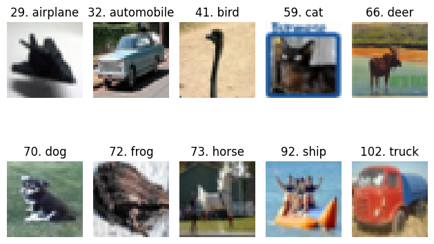

# CIFAR-10 Dataset
The `CIFAR-10` and `CIFAR-100` are labeled subsets of the `80` million tiny images dataset.  
The CIFAR-10 dataset consists of `60000 32x32x3` colour images in `10` classes, with 6000 images per class (balanced).  
There are `50,000` training images and `10,000` test images.  
It is widely used as a benchmark dataset for image classification models.  
Download dataset : [link](https://drive.google.com/drive/folders/1JRVec9F1eTH-EK0lb1idAaD5caTvD-tJ)

Creators:
  - [Alex Krizhevsky](https://en.wikipedia.org/wiki/Alex_Krizhevsky)
  - [Vinod Nair](https://scholar.google.com/citations?user=RnoIxUwAAAAJ&hl=en)
  - [Geoffrey Hinto](https://en.wikipedia.org/wiki/Geoffrey_Hinton)

# More Details
| Associated Tasks           | # Instances | # Features | Features Type | Class Type  | Missing Values |
| -------------------------- | ----------- | ---------- | ------------- | ----------- | -------------- |
| Classification, Clustering | 60000       | 3072       | Numerical     | Categorical | false          |

| #           | Attribute Name | Role        | Type        | Units       | Missing Values | Description                    |
| ----------- | -------------- | ----------- | ----------- | ----------- | -------------- | ------------------------------ |
| 0           | R-p0001        | Feature     | Numerical   |             | false          | 1st pixel (h=0, w=0, d=0)      |
| 1           | R-p0002        | Feature     | Numerical   |             | false          | 2nd pixel (h=0, w=1, d=0)      |
| 2           | R-p0003        | Feature     | Numerical   |             | false          | 3rd pixel (h=0, w=1, d=0)      |
| .<br>.<br>. | .<br>.<br>.    | .<br>.<br>. | .<br>.<br>. | .<br>.<br>. | .<br>.<br>.    | .<br>.<br>.                    |
| 3069        | B-p1022        | Feature     | Numerical   |             | false          | 1022nd pixel (h=27, w=25, d=2) |
| 3070        | B-p1023        | Feature     | Numerical   |             | false          | 1023rd pixel (h=27, w=26, d=2) |
| 3071        | B-p1024        | Feature     | Numerical   |             | false          | 1024th pixel (h=27, w=27, d=2) |
| 3072        | class          | `Target`    | Categorical |             | false          | object type                    |

## Categorical Attributes
```
| #    | Attribute Name | # Categories | Categories Name                                                      |
| ---- | -------------- | ------------ | -------------------------------------------------------------------- |
| 3072 | class          | 10           | airplane, automobile, bird, cat, deer, dog, frog, horse, ship, truck |
```

## Some Samples
Samples are chosen from trainset
```
| # Sample | R-p0001 | ... | R-p1024 | G_p0001 | ... | G-p1024 | B-p0001 | ... | B-p1024 | class      |
| -------- | ------- | --- | ------- | ------- | --- | ------- | ------- | --- | ------- | ---------- |
| 29       | 202     | ... |  219    |  220    | ... | 13      |  17     | ... |  243    | airplane   |
| 32       | 50      | ... |  75     |  88     | ... | 197     |  199    | ... |  162    | automobile |
| 41       | 145     | ... |  238    |  215    | ... | 197     |  160    | ... |  167    | bird       |
| 59       | 252     | ... |  148    |  149    | ... | 70      |  47     | ... |  240    | cat        |
| 66       | 212     | ... |  63     |  55     | ... | 30      |  33     | ... |  159    | deer       |
| 70       | 154     | ... |  98     |  124    | ... | 130     |  131    | ... |  146    | dog        |
| 72       | 229     | ... |  101    |  82     | ... | 7       |  7      | ... |  184    | frog       |
| 73       | 64      | ... |  93     |  93     | ... | 48      |  43     | ... |  81     | horse      |
| 92       | 106     | ... |  99     |  103    | ... | 161     |  146    | ... |  196    | ship       |
| 102      | 150     | ... |  121    |  86     | ... | 192     |  168    | ... |  94     | truck      |
```
<div align='center'></div>

# License
It seems like there is no specific license statement or agreement attached to the dataset by its creators or maintainers.

# Credit
The official website of the `CIFAR-10` dataset: [www.cs.toronto.edu/~kriz/cifar.html](https://www.cs.toronto.edu/~kriz/cifar.html).