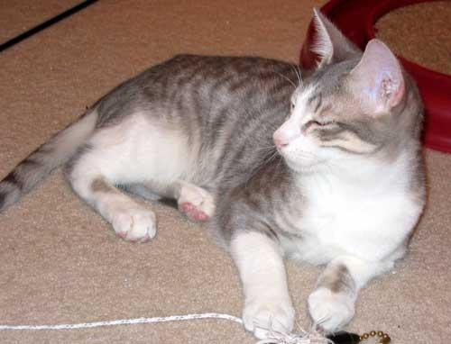
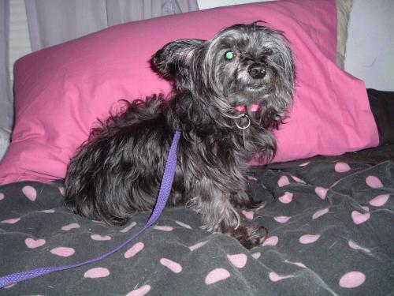

# Cats vs Dogs Dataset
It is a dataset with images of cats and dogs with different resolution and aspect ratio.  
Download dataset : [link](https://drive.google.com/drive/folders/1QoMRy8Dyia6LQ_ksDqM7A3ti_yc22c73)

Creators:
  - [Unknown](https://unknown.org)

# More Details
| Associated Tasks           | # Instances | # Features | Features Type | Class Type  | Missing Values |
| -------------------------- | ----------- | ---------- | ------------- | ----------- | -------------- |
| Classification, Clustering | 24996       | variable   | Numerical     | Categorical | false          |

Pixels noted in the below tables are considered for flattened images.

| #           | Attribute Name | Role        | Type        | Units       | Missing Values | Description                   |
| ----------- | -------------- | ----------- | ----------- | ----------- | -------------- | ----------------------------- |
|  0          | p1             | Feature     | Numerical   |             | false          | 1st pixel (h=0 |  w=0 |  d=0) |
|  1          | p2             | Feature     | Numerical   |             | false          | 2nd pixel (h=0 |  w=1 |  d=0) |
|  2          | p3             | Feature     | Numerical   |             | false          | 3rd pixel (h=0 |  w=2 |  d=0) |
|  3          | p4             | Feature     | Numerical   |             | false          | 4th pixel (h=0 |  w=3 |  d=0) |
| .<br>.<br>. | .<br>.<br>.    | .<br>.<br>. | .<br>.<br>. | .<br>.<br>. | .<br>.<br>.    | .<br>.<br>.                   |
| ?           | class          | `Target`    | Categorical |             | false          | animal type                   |

## Categorical Attributes
```
| # | Attribute Name | # Categories | Categories Name |
| - | -------------- | ------------ | --------------- |
| ? | class          | 2            | Cat, Dog        |
```

## Some Samples
```
| # Directory   | p1  | p2  | p3  | p4  | ... | class |
| ------------- | --- | --- | --- | --- | --- | ----- |
| ./Cat/0.jpg   | 203 | 164 | 87  | 203 | ... | Cat   |
| ./Cat/1.jpg   | 36  | 41  | 37  | 37  | ... | Cat   |
| ./Cat/62.jpg  | 98  | 60  | 39  | 96  | ... | Cat   |
| ./Dog/0.jpg   | 117 | 115 | 126 | 117 | ... | Dog   |
| ./Dog/95.jpg  | 3   | 13  | 15  | 2   | ... | Dog   |
| ./Dog/124.jpg | 116 | 82  | 55  | 111 | ... | Dog   |
```
<!--  -->
<div style= "display: flex;align-items: flex-end">
  <div align='center'><div>./Cat/0.jpg</div></div>
  <div align='center'><div>./Cat/1.jpg</div></div>
  <div align='center'><div>./Cat/62.jpg</div></div>
  <div align='center'><div>./Dog/0.jpg</div></div>
  <div align='center'><div>./Dog/95.jpg</div></div>
  <div align='center'><div>./Dog/124.jpg</div></div>
</div>

# License
This dataset is licensed under the [Community Data License Agreement - Permissive - Version 2.0](https://cdla.dev/permissive-2-0/).  
TL;DR: It is a permissive license that allows open data contributors to share data as long as the Data Recipient keeps the text of this agreement with the shared Data.

# Credit
Visit [microsoft.com/en-us/download/details.aspx?id=54765](https://www.microsoft.com/en-us/download/details.aspx?id=54765) for more information.