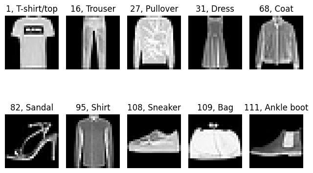

# Fasion-MNIST Dataset
It is a dataset containing `70,000` images of clothes (`10 class labels`) with each example represented as an image of `28 x 28` gray-scale pixels where each pixel value represents the intensity of the pixel on a scale of `0 to 255`.  
There are `60,000` training images and `10,000` test images.  
It is a good alternative for `MNIST` which is a little bit overused. The clothes have been `size-normalized` and `centered` in a fixed-size image.  
It is widely used as a benchmark dataset for image classification models.  
Download dataset : [link](https://drive.google.com/drive/folders/1cKDs5Dm8vaacBHy_zQESGNsJfDTwY8u9)

Creators:
  - [Han Xiao](https://de.linkedin.com/in/hxiao87)
  - [Kashif Rasul](https://de.linkedin.com/in/kashif-rasul)
  - [Roland Vollgraf](https://de.linkedin.com/in/rolandvollgraf)

# More Details
| Associated Tasks           | # Instances | # Features | Features Type | Class Type  | Missing Values |
| -------------------------- | ----------- | ---------- | ------------- | ----------- | -------------- |
| Classification, Clustering | 70000       | 784        | Numerical     | Categorical | false          |

| #           | Attribute Name | Role        | Type        | Units       | Missing Values | Description              |
| ----------- | -------------- | ----------- | ----------- | ----------- | -------------- | ------------------------ |
| 0           | p001           | Feature     | Numerical   |             | false          | 1st pixel (h=0, w=0)     |
| 1           | p002           | Feature     | Numerical   |             | false          | 2nd pixel (h=0, w=1)     |
| 2           | p003           | Feature     | Numerical   |             | false          | 3rd pixel (h=0, w=1)     |
| .<br>.<br>. | .<br>.<br>.    | .<br>.<br>. | .<br>.<br>. | .<br>.<br>. | .<br>.<br>.    | .<br>.<br>.              |
| 781         | p782           | Feature     | Numerical   |             | false          | 782nd pixel (h=27, w=25) |
| 782         | p783           | Feature     | Numerical   |             | false          | 783rd pixel (h=27, w=26) |
| 783         | p784           | Feature     | Numerical   |             | false          | 784th pixel (h=27, w=27) |
| 784         | class          | `Target`    | Categorical |             | false          | cloth type               |

## Categorical Attributes
```
| #   | Attribute Name | # Categories | Categories Name                                                                     |
| --- | -------------- | ------------ | ----------------------------------------------------------------------------------- |
| 784 | class          | 10           | T-shirt/top, Trouser, Pullover, Dress, Coat, Sandal, Shirt, Sneaker, Bag, AnkleBoot |
```

## Some Samples
Samples are chosen from trainset
```
| # Sample | p001 | p002 | p003 | p004 | ... | p781 | p782 | p783 | p784 | class       |
| -------- | ---- | ---- | ---- | ---- | --- | ---- | ---- | ---- | ---- | ----------- |
| 1        | 0    | 0    | 0    | 0    | ... | 0    | 0    | 0    | 0    | T-shirt/top |
| 16       | 0    | 0    | 0    | 0    | ... | 0    | 0    | 0    | 0    | Trouser     |
| 27       | 0    | 0    | 0    | 1    | ... | 0    | 0    | 0    | 0    | Pullover    |
| 31       | 0    | 0    | 0    | 0    | ... | 0    | 0    | 0    | 0    | Dress       |
| 68       | 0    | 0    | 0    | 0    | ... | 214  | 112  | 0    | 0    | Coat        |
| 82       | 0    | 0    | 0    | 0    | ... | 0    | 0    | 0    | 0    | Sandal      |
| 95       | 0    | 0    | 0    | 0    | ... | 36   | 0    | 0    | 0    | Shirt       |
| 108      | 0    | 0    | 0    | 0    | ... | 0    | 0    | 0    | 0    | Sneaker     |
| 109      | 0    | 0    | 0    | 0    | ... | 0    | 0    | 0    | 0    | Bag         |
| 111      | 0    | 0    | 0    | 0    | ... | 0    | 0    | 0    | 0    | AnkleBoot   |
```
<div align='center'></div>

# License
This dataset is licensed under The MIT License (MIT) Copyright © 2017 Zalando SE, [tech.zalando.com](https://tech.zalando.com)  
TL;DR: This allows users to freely use, modify, and distribute software while disclaiming any liability.

# Credit
The official website of the `Fashion-MNIST` dataset: [github.com/zalandoresearch/fashion-mnist](https://github.com/zalandoresearch/fashion-mnist).