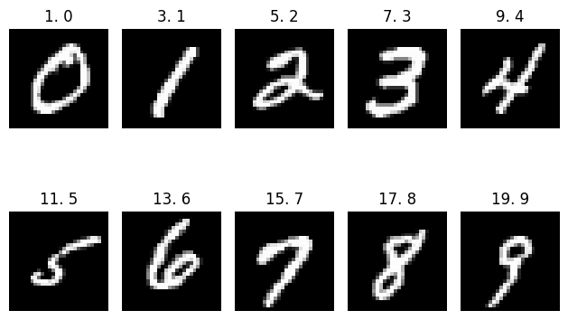

# MNIST Dataset
Well-known dataset of `70,000` handwritten digits (`10 class labels`) with each example represented as an image of `28 x 28` gray-scale pixels where each pixel value represents the intensity of the pixel on a scale of `0 to 255`.  
There are `60000` training images and `10000` test images.  
It is a subset of a larger set available from `NIST`. The digits have been `size-normalized` and `centered` in a fixed-size image.  
It is widely used as a benchmark dataset for handwritten digit recognition and image classification models.

Creators:
  - [Yann LeCun](http://yann.lecun.com)
  - [Corinna Cortes](https://research.google/people/author121)
  - [Christopher J.C. Burges](https://chrisburges.net)

# More Details
| Associated Tasks           | # Instances | # Features | Features Type | Class Type  | Missing Values |
| -------------------------- | ----------- | ---------- | ------------- | ----------- | -------------- |
| Classification, Clustering | 70000       | 784        | Numerical     | Categorical | false          |

| #           | Attribute Name | Role        | Type        | Units       | Missing Values | Description              |
| ----------- | -------------- | ----------- | ----------- | ----------- | -------------- | ------------------------ |
| 0           | p001           | Feature     | Numerical   |             | false          | 1st pixel (h=0, w=0)     |
| 1           | p002           | Feature     | Numerical   |             | false          | 2nd pixel (h=0, w=1)     |
| 2           | p003           | Feature     | Numerical   |             | false          | 3rd pixel (h=0, w=1)     |
| .<br>.<br>. | .<br>.<br>.    | .<br>.<br>. | .<br>.<br>. | .<br>.<br>. | .<br>.<br>.    | .<br>.<br>.              |
| 781         | p782           | Feature     | Numerical   |             | false          | 782nd pixel (h=27, w=25) |
| 782         | p783           | Feature     | Numerical   |             | false          | 783rd pixel (h=27, w=26) |
| 783         | p784           | Feature     | Numerical   |             | false          | 784th pixel (h=27, w=27) |
| 784         | class          | `Target`    | Categorical |             | false          | digit type               |

## Categorical Attributes
```
| #   | Attribute Name | # Categories | Categories Name              |
| --- | -------------- | ------------ | ---------------------------- |
| 784 | class          | 10           | 0, 1, 2, 3, 4, 5, 6, 7, 8, 9 |
```

## Some Samples
Samples are chosen from trainset
```
| # Sample | p001 | p002 | p003 | p004 | ... | p781 | p782 | p783 | p784 | class |
| -------- | ---- | ---- | ---- | ---- | --- | ---- | ---- | ---- | ---- | ----- |
| 1        | 0    | 0    | 0    | 0    | ... | 0    | 0    | 0    | 0    | 0     |
| 3        | 0    | 0    | 0    | 0    | ... | 0    | 0    | 0    | 0    | 1     |
| 5        | 0    | 0    | 0    | 0    | ... | 0    | 0    | 0    | 0    | 2     |
| 7        | 0    | 0    | 0    | 0    | ... | 0    | 0    | 0    | 0    | 3     |
| 9        | 0    | 0    | 0    | 0    | ... | 0    | 0    | 0    | 0    | 4     |
| 11       | 0    | 0    | 0    | 0    | ... | 0    | 0    | 0    | 0    | 5     |
| 13       | 0    | 0    | 0    | 0    | ... | 0    | 0    | 0    | 0    | 6     |
| 15       | 0    | 0    | 0    | 0    | ... | 0    | 0    | 0    | 0    | 7     |
| 17       | 0    | 0    | 0    | 0    | ... | 0    | 0    | 0    | 0    | 8     |
| 19       | 0    | 0    | 0    | 0    | ... | 0    | 0    | 0    | 0    | 9     |
```
<div align='center'></div>

# License
It seems like there is no specific license statement or agreement attached to the dataset by its creators or maintainers.

# Credit
The official website of the `MNIST` dataset: [yann.lecun.com/exdb/mnist](http://yann.lecun.com/exdb/mnist).